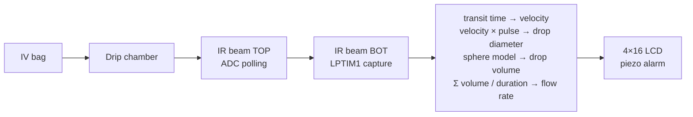
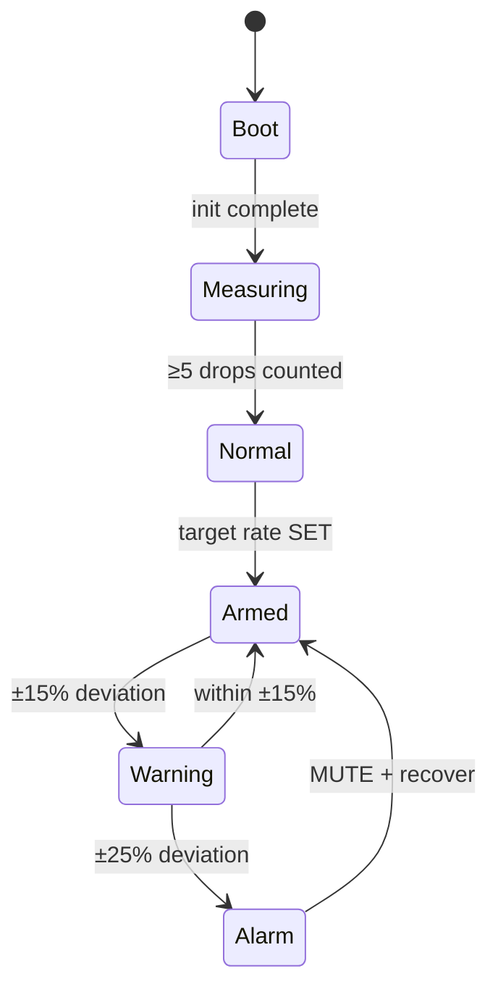

# Dripito — IV Drip Flow Monitor (Rev-B)

> Improving a low-cost intravenous infusion flow-rate monitoring device
> for paediatric care in humanitarian healthcare settings.
> ETH Zürich, Global Health Engineering — semester project, 2026.

A single-AA-cell IV drip monitor for resource-constrained clinical
environments. Custom STM32G0 PCB, optical dual-beam drop detection,
monochrome graphic LCD, piezo alarm, ASA-printed enclosure with
gear-driven broom-holder chamber clamp.

## Architecture

**Detection — dual-beam optical, two-phase.** A drop falling through
the drip chamber occludes two stacked IR beams. ADC polling on Phase 1
captures the leading edge; LPTIM1 input capture on Phase 2 records
sub-millisecond transit time between beams. Velocity → drop diameter
(chord-length approximation) → sphere-model volume → flow rate.



**State machine — IEC 60601-2-24 compliant.**



## At a glance

| | |
|---|---|
| **MCU** | STM32G071C8TX |
| **Hardware** | Rev-B PCB, KiCad 8.x, hand-assembled |
| **Detection** | Dual-beam optical, sphere-model volume calibration |
| **Power** | Single AA Li-ion via FFC, TPS610982 boost converter |
| **Enclosure** | ASA white FDM, gear-driven broom-holder chamber clamp, 14–24 mm OD |
| **Validation** | 21 runs vs gravimetric ground truth, 3 flow rates × macro-20 drip set |
| **Reproducibility** | `docker compose up regenerate-figures-sample` regenerates every plot from raw CSVs ([`analysis/`](analysis/README.md)) |
| **Submission** | 2026-05-14 |

## Repository layout

```
hardware/    KiCad 8.x project — schematic, PCB, libs, datasheets, gerbers
firmware/    STM32CubeIDE workspace (InfusionBA2 Rev-B)
enclosure/   Onshape exports, STLs, print profiles, print history
docs/        Decisions, requirements, results, limitations
data/        Raw validation CSVs, calibration log, geometry, edge cases
analysis/    Reproducible analysis pipeline
media/       Photos, renders, demo clips
```

Each folder has its own `README.md`.

## Where to upload what

| You have | Put it in |
|---|---|
| KiCad schematic / PCB edits | `hardware/` |
| Custom KiCad symbols | `hardware/lib/` |
| Custom KiCad footprints | `hardware/IV_Flow_Monitor_Footprints.pretty/` |
| Component datasheets | `hardware/datasheets/` |
| Re-exported Gerbers + drill + CPL | `hardware/gerbers/` |
| 3D part models for KiCad | `hardware/3dmodels/` |
| Hardware automation scripts | `hardware/scripts/` |
| Firmware code | `firmware/STM32CubeIDE/InfusionBA2/Core/` |
| Onshape STEP exports | `enclosure/onshape_exports/` |
| Printer-ready STLs | `enclosure/stl/` |
| Slicer profiles | `enclosure/print_settings/` |
| Print iteration logs | `enclosure/print_history/` (one Markdown file per attempt) |
| Architecture decision (ADR) | `docs/decisions/<topic>.md` |
| Reports, specs, narrative | `docs/<topic>.md` |
| Raw validation run CSVs | `data/raw/` |
| Edge-case observations | `data/edge_cases/` |
| Calibration log row | append to `data/calibration_log.csv` |
| Per-session metadata row | append to `data/session_log.csv` |
| Analysis notebook | `analysis/notebooks/` |
| Generated figures | `analysis/figures/` |
| Photos, renders, demo clips | `media/` |

## Build and flash

1. Open `firmware/STM32CubeIDE/InfusionBA2/` in STM32CubeIDE.
2. *Project → Build All*.
3. Connect ST-Link, *Run → Debug*.

Pin maps in [`firmware/README.md`](firmware/README.md).

## Validation

Bench protocol fixed before data collection — discard rules, output
schemas, and analysis methods stated in advance so the Discussion is
not shaped by what happened on the bench. Campaign at ETH Hangar,
gravimetric ground truth (precision scale ±0.0001 g) against
macro-20 drip-set runs at 20, 50, 100 mL/hr. Full protocol in
[`docs/testing-and-validation.md`](docs/testing-and-validation.md).

## Reproducible analysis

Every validation figure is regenerated from raw CSVs by one command
on a clean machine with Docker:

```bash
cd analysis/
docker compose up regenerate-figures-sample   # cold-clone repro test
docker compose up regenerate-figures          # real campaign data
```

The pipeline executes [`analysis/notebooks/validation.ipynb`](analysis/notebooks/validation.ipynb)
headlessly via papermill and writes Bland-Altman plots, bootstrap
MAPE tables, error-vs-flow scatters, and drop-volume distributions
to [`analysis/figures/`](analysis/README.md). Dependencies pinned in
[`analysis/requirements.txt`](analysis/requirements.txt) (hash-locked,
installed with `pip install --require-hashes`). Deterministic random
seeds — re-runs are byte-identical.

Pipeline contract and figure inventory: [`analysis/README.md`](analysis/README.md).

## Hardware fabrication

PCB from `hardware/gerbers/` (JLCPCB / PCBWay). Enclosure printed in ASA
white per the profile in `enclosure/print_settings/`. Full enclosure
requirements (hand-off for follow-up work) in
[`docs/enclosure-requirements.md`](docs/enclosure-requirements.md).

## Citation

A bachelor thesis preceded this work:

> Catarci, L. (2025). *Improving a Low-Cost Intravenous Infusion
> Flow-Rate Monitoring Device for Paediatric Care in Humanitarian
> Healthcare Settings*. ETH Zürich, Global Health Engineering.
> DOI: [10.5281/zenodo.16902366](https://doi.org/10.5281/zenodo.16902366).

The Rev-B work in this repository receives its own Zenodo DOI on
submission *(populated at submission)*.

## License

- Code, firmware, docs, data: [CC BY 4.0](LICENSE-CC-BY-4.0.md)
- Hardware (KiCad project, custom symbols, most footprints):
  [CERN OHL 2.0 Permissive](LICENSE-CERN-OHL-2-PERMISSIVE.md)
- Three specific custom footprints:
  [CC BY-SA 4.0](LICENSE-CC-BY-SA-4.0.md) — see
  [`hardware/IV_Flow_Monitor_Footprints.pretty/README.md`](hardware/IV_Flow_Monitor_Footprints.pretty/README.md)
- CubeMX/HAL files retain `Copyright (c) STMicroelectronics` headers.

## Author and supervision

**Leandro Catarci** — MSc Mechanical Engineering, ETH Zürich.
Semester project at ETH Global Health Engineering, 2026.

**Jakub Tkaczuk** — Supervisor.

**Prof. Elizabeth Tilley** — Group head, Chair of Global Health Engineering, ETH Zürich.
