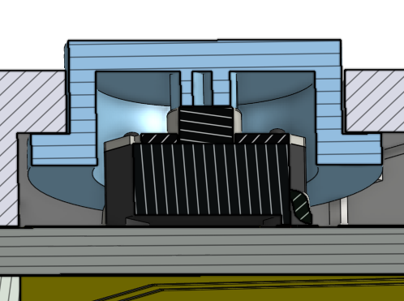

# enclosure/

> **Current Rev-B enclosure is not the final mechanical design.** A full rework is expected for Rev-C. The Rev-B enclosure exists to integrate the PCB + chamber holder + optics + battery into a single testable assembly so the rest of the device (electronics, firmware, validation campaign) could be exercised. Documented honestly here; planned Rev-C path captured in the cross-referenced ADRs below.

## Where the CAD lives

- **Source CAD:** Onshape document `Dripito Rev-B`. Edits happen there.
- **Versioned exports (STEP + STL):** [`../hardware/3dmodels/Enclosure/`](../hardware/3dmodels/Enclosure/). Populated as the source CAD is exported. The exporter is manual — there is no automation; regenerate after meaningful CAD changes.

This folder (`enclosure/`) carries the rationale, requirements spec, and printing guidance. The geometry itself lives next to the PCB models in `hardware/3dmodels/Enclosure/`.

## Material

ASA white (Acrylonitrile Styrene Acrylate). Decision rationale: [`../docs/decisions/enclosure-material.md`](../docs/decisions/enclosure-material.md). Brief: ASA chosen over PETG (lower UV resistance) and ABS (higher warping risk) for outdoor humanitarian deployment contexts. White colouring reduces solar heat absorption.

## Fastener mechanism

Snap-fit assembly. No heat-set inserts, no threaded fasteners. The trade-off is that snap-fit reliability depends on print tolerance, and disassembly for service requires either flexing the snap-fit lugs or accepting that the enclosure is functionally non-serviceable. See [`../docs/decisions/enclosure-material.md`](../docs/decisions/enclosure-material.md) for the alternative path (M2 brass heat-set inserts + button-head screws) that was rejected for Rev-B.

## Print profile defaults

- Layer height: 0.2 mm (sensor arm: 0.15 mm at optical faces)
- Wall count: 4
- Top/bottom layers: 5
- Infill: 30 % gyroid
- Print orientation: sensor arm prints with the optical bore axis vertical so the LED / PD bores form circular cross sections rather than stair-stepped ellipses
- Support: tree, only where required

ASA process settings (varies by spool): enclosed chamber, ~100 °C bed, ~250 °C nozzle. Calibrate the printer before running the parts.

## Button stack-up

Cross-section through a front-plate button. From bottom to top:

- **PCB** (yellow strip)
- **Tactile switch** (PTS647 series, centre — ribbed black SMD body)
- **Front-plate housing** (cross-hatched) with a chamfered bore that captures the cap
- **Button cap** (blue) with a chamfered guide that limits lateral travel

The cap presses the tactile switch directly through the housing bore. No separate light pipe or actuator pin — travel is bounded by the housing chamfer above and the switch dome below.

## Chamber-OD compatibility

Designed for ISO 8536-4-compliant drip chambers, **14–24 mm outer diameter** (microdrip + standard adult macrodrip). Validated against a Ø20 mm reference chamber.

Wide-body / transfusion chambers (25–30 mm) are **out of scope** for Rev-B. Addressable in a future revision via an interchangeable cradle insert reusing the same optical-bay interface. See [`../docs/enclosure-requirements.md`](../docs/enclosure-requirements.md) for the full spec.

## Known limitations of the Rev-B enclosure

The current Rev-B build has known mechanical compromises that were accepted to unblock the validation campaign. These are surfaced in the architecture decision records and in `docs/limitations.md`:

- **Chamber holder geometry** — sliding gear with IR-beam pass-through forces a wide beam-to-sensor distance; partly responsible for the position-dependence finding in [`../docs/limitations.md`](../docs/limitations.md) §Position-dependence. See [`../docs/decisions/chamber-holder-mechanism.md`](../docs/decisions/chamber-holder-mechanism.md).
- **Sensor-arm alignment is FDM-tolerance-bound (±0.2 mm).** Rev-C path is injection moulding (±0.05 mm). See [`../docs/decisions/sensor-arm-alignment.md`](../docs/decisions/sensor-arm-alignment.md).
- **External AA battery holder** acts as counterbalance but increases horizontal footprint, which may interfere with adjacent IV lines in a crowded clinical bay. See [`../docs/decisions/enclosure-geometry.md`](../docs/decisions/enclosure-geometry.md).
- **IP54 ingress protection is an aspiration**, not validated against IEC 60529 in Rev-B. See [`../docs/decisions/enclosure-material.md`](../docs/decisions/enclosure-material.md) §Outlook.

## Cross-references

- Requirements spec for Rev-C / follow-up: [`../docs/enclosure-requirements.md`](../docs/enclosure-requirements.md)
- ADRs governing the enclosure decisions: [`../docs/decisions/enclosure-material.md`](../docs/decisions/enclosure-material.md), [`../docs/decisions/enclosure-geometry.md`](../docs/decisions/enclosure-geometry.md), [`../docs/decisions/chamber-holder-mechanism.md`](../docs/decisions/chamber-holder-mechanism.md), [`../docs/decisions/sensor-arm-alignment.md`](../docs/decisions/sensor-arm-alignment.md)
- Geometry measurement protocol (EXP-1): [`../docs/testing-and-validation.md`](../docs/testing-and-validation.md)
- Geometry data per board: [`../data/geometry.json`](../data/README.md)
